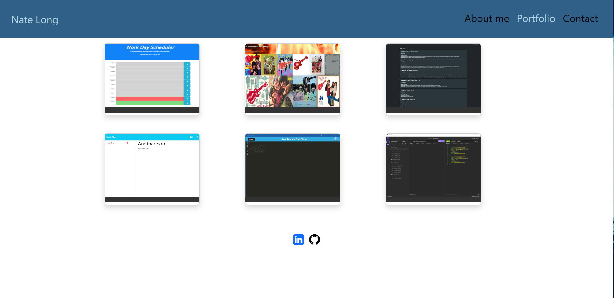

# Module 20 Challenge: React Portfolio

## Description

This project was done with React, it operates as a single-page application. This project uses HTML, CSS, React, and EmailJS.

## Table of Contents
- [Installation](#installation)
- [Usage](#usage)
- [License](#license)
- [Screenshot](#screenshot)
- [Contributing](#contributing)
- [Questions](#questions)

## Installation

In your terminal enter `npm i` then `npm start` to download all of the required dependencies.

## Usage

See the installation section in order to install and launch the project on your local machine. You can also view the live version of the web page here:

## License

This project uses the MIT license.

## Screenshot

## Contributing

Helpful e-mails or tips to make this project work better are ALWAYS appreciated. Even helpful criticism would be warmly welcomed. Special shoutout to my classmates, TA, and instructor for making this project achievable. Also a huge thank you to my tutors, dozens of docs read, videos watched and all who have help make this project understandable and make the logic and reasoning digestable. 

## Questions

Any further questions e-mail me: nate.k.long@gmail.com

Check out my other projects: https://www.github.com/Tunestring